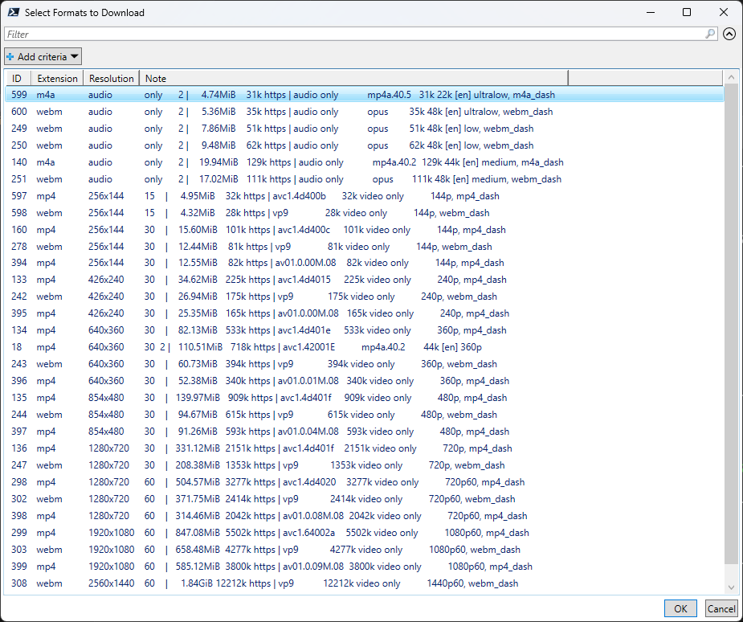
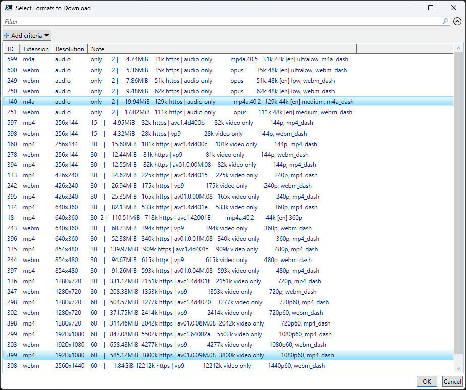

# PowerShell Youtube Downloader
Allows customized download of Youtube and other videos.

## Description
A PowerShell script that allows you to customize the video and audio formats that are downloaded to your PC using [YT-DLP](https://github.com/yt-dlp/yt-dlp).

The script first downloads a list of all the audio and video formats available for a given video URL. It then displays them in a multi-selectable grid. You can select the audio and video format you wish to download. The script downloads and merges the formats into a single file and displays them.

## Requirements
You need the following in the same folder as the script:

1. YT-DLP: https://github.com/yt-dlp/yt-dlp
2. FFMPEG: There are 2 versions you can get:

    a. [Standard Version](https://github.com/yt-dlp/FFmpeg-Builds)

    b. [YT-DLP Static Build](https://github.com/yt-dlp/FFmpeg-Builds) (Recommended)

You can also optionally create a `yt-dlp.conf` file in the same folder with defaults for the YT-DLP executable. 

## Usage
Simply run the Powershell script with the video URL as a paramter. For example:

`.\DownloadVideo.ps1 <video-url>`

This will first download the available formats and then display them in a grid like this:

Select an audio and a video format using Ctrl-Click. For instance:

Click the OK button at the bottom right of the grid to continue. The script will download the 2 formats and merge them into a single video file. The path to the file will then be displayed.
